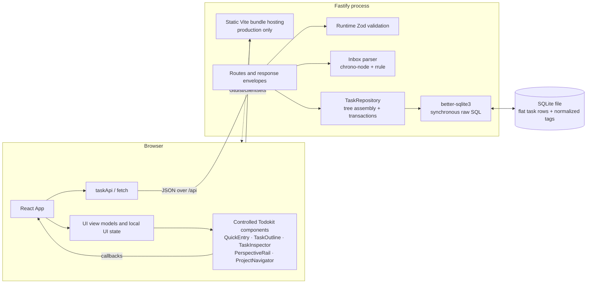

# Architecture

## System boundary

Todokit Full Stack is a single-user web application with one React browser client, one Fastify server process, and one SQLite database. SQLite is the source of truth. There is no authentication, authorization, tenant identifier, or per-user ownership column.

## Browser client

`src/client/main.tsx` mounts `App` under React `StrictMode` and imports both Todokit's packaged stylesheet and the application stylesheet. `src/client/App.tsx` owns all state and supplies controlled values and callbacks to the Todokit dependency:

- `TodoKitLayout` composes the rail, tag navigator, main outline, and inspector.
- `QuickEntry` receives `quickText`; submission calls `taskApi.create({ rawText })`.
- `TaskOutline` receives a recursively derived `TaskViewModel[]`. Selection, expansion, completion, and subtask creation are handled by `App`.
- `TaskInspector` receives a derived `TaskInspectorViewModel`. Its changes become API patches.
- `PerspectiveRail` and `ProjectNavigator` receive client-computed counts and filters.

Todokit is a pinned Git dependency and supplies presentation components, not persistence or application state. The application filters perspectives and tags in memory. A matching descendant keeps its ancestor chain visible. Inspector edits are applied optimistically and serialized per task with a promise chain; failures display an error and reload the server tree. Creates, completion changes, and deletes wait for the request and then refresh the full tree.

`src/client/api.ts` defines `taskApi`. Its shared request function uses same-origin `fetch`, sends JSON, unwraps successful `{ "data": ... }` responses, and converts error envelopes into `ApiClientError`. The client does not call the single-task `GET` route because it keeps the complete tree locally.

The shared inbox parser also runs in the browser to preview tags, due dates, recurrence, and warnings. The server parses again on submission and is authoritative.

## Data shapes and tree assembly

Three shapes must not be conflated:

| Layer | Shape | Where it is produced |
| --- | --- | --- |
| SQLite | Flat rows with snake_case columns; booleans are `0`/`1`; tags are separate rows | `tasks`, `tags`, and `task_tags` |
| API/domain | CamelCase `Task` objects with booleans, `tags: string[]`, `depth`, and recursive `children` | `TaskRepository.mapRow` and `rowsToTree` |
| UI | Todokit `TaskViewModel` / `TaskInspectorViewModel` objects plus local selection and expansion state | `taskView` and `inspectorView` in `App.tsx` |

SQLite recursive CTEs return a flat, depth-first ordered result. The tag subquery adds a JSON array per task row. `mapRow` changes column names and converts integer booleans. `rowsToTree` then indexes mapped tasks by ID and pushes each task into its parent's `children`; tasks whose parent is absent from that result become result roots. Tree assembly therefore occurs in `TaskRepository`, after SQL and before route serialization. The database does not store JSON trees, and the browser does not assemble API rows into trees.

`GET /api/tasks` anchors the CTE at every database root and returns `Task[]`. `GET /api/tasks/:id` anchors it at one task, resets that result's `depth` to `0`, and returns one `Task`. The anchored task retains its database `parentId`, even though its parent is outside the returned subtree.

The UI derives narrower view models from the API tree. In particular, it slices due/review values to `YYYY-MM-DD`, calculates overdue state, supplies expansion state, and omits persistence-only fields from Todokit components.

## Server request flow

`src/server/main.ts` opens the database, creates the Fastify application with logging, and listens on `0.0.0.0`. `PORT` defaults to `3001` and must parse as an integer from `1` through `65535`.

Fastify has a `64 * 1024` byte body limit. The routes are:

| Method | Path | Runtime behavior |
| --- | --- | --- |
| `GET` | `/health` | Executes `SELECT 1`; returns `{ "status": "ok" }` without a `data` envelope. |
| `GET` | `/api/tasks` | Returns the complete task tree. |
| `GET` | `/api/tasks/:id` | Validates a UUID and returns the task subtree. |
| `POST` | `/api/tasks` | Validates raw or explicit input, parses inbox text when present, canonicalizes recurrence, creates a task, and returns `201`. |
| `PATCH` | `/api/tasks/:id` | Validates a nonempty patch, canonicalizes recurrence when non-null, and updates details, state, tags, or parent. |
| `POST` | `/api/tasks/:id/completion` | Accepts exactly `{ "completed": boolean }` and delegates to the repository update path. |
| `DELETE` | `/api/tasks/:id` | Deletes the selected task and descendants transactionally and returns the deleted row count. |

Zod validates route parameters and request bodies at runtime. Raw inbox creates pass through `parseInboxInput`; parser warnings become `422 PARSE_ERROR`. Non-null recurrence values pass through `normalizeRecurrence`; invalid rules become `422 VALIDATION_ERROR`. The repository validates parent existence and rejects cyclic moves.

Application route successes use `{ "data": ... }`, except `/health`. The error handler converts:

- Zod errors to `400 VALIDATION_ERROR` with an array of `{ path, message }`;
- `AppError` instances to their declared status and code (`404 NOT_FOUND`, `409 CONFLICT`, or the route's `422` errors);
- malformed requests to `400 INVALID_REQUEST`;
- bodies over the Fastify limit to `413 PAYLOAD_TOO_LARGE`;
- unexpected errors to a logged `500 INTERNAL_ERROR`.

Unknown `/api/...` paths and an unmatched request whose URL is exactly `/health` return a JSON `404 NOT_FOUND`. When static hosting is enabled, other unknown paths return `index.html` for client-side navigation.

## Parser

`src/shared/parser.ts` is deterministic for a supplied reference `Date`. The server calls it without an explicit reference, so it uses the server's current time; parsing passes UTC (`timezone: 0`) to `chrono-node`. It:

1. recognizes one supported natural recurrence outside quoted text;
2. extracts, lowercases, and de-duplicates supported `#tags`;
3. recognizes a deliberately constrained date phrase;
4. removes recognized metadata spans and returns the remaining title;
5. reports `INVALID_DATE` or `INVALID_RECURRENCE` warnings rather than removing invalid text.

Date-only results stay `YYYY-MM-DD`; results with a time become UTC ISO timestamps. Recurrence normalization accepts supported natural intervals or one RRULE, rejects multiline/`DTSTART` input, and returns one canonical line beginning `RRULE:`.

The recurrence value is only metadata. Completing a recurring task does not create its next occurrence.

## Persistence boundary

`TaskRepository` is the only application abstraction over persistence. It contains handwritten parameterized SQL and synchronous `better-sqlite3` calls; there is no ORM or query builder. It owns:

- recursive full-tree and subtree reads;
- database-row to API-task mapping and in-process tree assembly;
- UUID and UTC audit timestamp generation;
- append-only sibling position allocation;
- parent and cycle checks;
- create, patch, completion, tag replacement, and subtree-delete transactions.

The current design is single-process synchronous SQLite access. A request doing database work blocks that Node.js process while the call runs. WAL and a five-second busy timeout improve file-level concurrency, but the application has no distributed locking or coordination for multiple server replicas.

## Startup and shutdown

`openDatabase` resolves the configured path, recursively creates missing parent directories for file databases, opens SQLite, applies PRAGMAs, and runs pending `user_version` migrations. `TODO_DB_PATH` selects the file; an unset or empty value uses `data/todos.sqlite` resolved from the process working directory. `:memory:` is used by tests and skips directory creation and WAL.

After database initialization, `createApp` registers routes, error handling, and optional static serving. By default it serves `dist/client` only if that directory exists.

The process installs one-time `SIGINT` and `SIGTERM` handlers. Shutdown is idempotent: it logs the signal, awaits `app.close()`, then closes SQLite and sets exit code `0`. A shutdown failure sets exit code `1`. A listen failure is logged, closes SQLite, and also sets exit code `1`.

## Development and production runtime

Local development uses `npm run dev`, which starts two processes:

- `tsx watch src/server/main.ts` runs Fastify on port `3001`;
- Vite serves the browser app on port `5173` and proxies `/api` and `/health` to `http://localhost:3001`.

Static hosting normally remains inactive in development because `dist/client` need not exist. If that directory already exists, the separately running Fastify process can still register it, but browser development traffic is served by Vite.

`npm run build` writes the Vite bundle to `dist/client` and TypeScript server/shared output to `dist`. `npm start` runs `dist/server/main.js`; that one Fastify process serves both API routes and the Vite bundle.

Production is a single-container, single-process deployment. The multi-stage `Dockerfile` builds with Node 22, prunes development dependencies, and runs as the unprivileged `node` user. Its defaults are `PORT=3001` and `TODO_DB_PATH=/data/todos.sqlite`; `/data` is created, owned by `node`, declared as a volume, and used by the health check. `docker-compose.yml` maps port `3001` and mounts the `todo-data` named volume at `/data`.

## CI and container publishing

`.github/workflows/ci.yml` runs on pushes to `main` and pull requests. On Node 22 it performs `npm ci`, lint, both TypeScript checks, the Vitest suite, and the production build.

`.github/workflows/container.yml` runs on pushes to `main` and tags matching `v*.*.*`. It uses Buildx to build and push `linux/amd64` and `linux/arm64` images to `ghcr.io/aghanim-bot/todokit-fullstack`. Metadata produces `latest` on the default branch, semantic-version tags for releases, and a commit-SHA tag. Publishing authenticates with the workflow `GITHUB_TOKEN`.

## Current limitations

- Database access is synchronous and designed around one server process.
- There is no authentication, authorization, multi-user ownership, or tenant isolation.
- Recurrence is parsed and stored but does not generate tasks.
- Sibling order is stable, but the UI has no reordering control.
- The client reloads the entire tree after most mutations; there is no pagination or incremental sync.
- Parsing supports a constrained English syntax and uses the server's UTC calendar.
