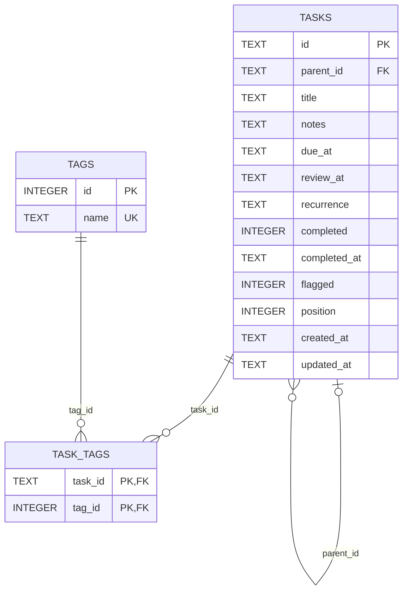

# Database

## Storage model

The application uses SQLite through synchronous `better-sqlite3` calls and handwritten SQL. The schema is currently version `1`. Tags are normalized into `tags` and `task_tags`. In contrast, the hierarchy deliberately remains in one non-separated, self-referencing `tasks` table rather than being normalized into distinct task and hierarchy-edge tables.



## Schema migration 1

The migration in `src/server/database.ts` creates the following schema:

```sql
CREATE TABLE tasks (
  id TEXT PRIMARY KEY,
  parent_id TEXT REFERENCES tasks(id) ON DELETE CASCADE,
  title TEXT NOT NULL CHECK (length(trim(title)) BETWEEN 1 AND 500),
  notes TEXT NOT NULL DEFAULT '',
  due_at TEXT,
  review_at TEXT,
  recurrence TEXT,
  completed INTEGER NOT NULL DEFAULT 0 CHECK (completed IN (0, 1)),
  completed_at TEXT,
  flagged INTEGER NOT NULL DEFAULT 0 CHECK (flagged IN (0, 1)),
  position INTEGER NOT NULL CHECK (position >= 0),
  created_at TEXT NOT NULL,
  updated_at TEXT NOT NULL,
  CHECK (
    (completed = 0 AND completed_at IS NULL)
    OR (completed = 1 AND completed_at IS NOT NULL)
  ),
  CHECK (parent_id IS NULL OR parent_id <> id)
);

CREATE TABLE tags (
  id INTEGER PRIMARY KEY,
  name TEXT NOT NULL COLLATE NOCASE UNIQUE
    CHECK (length(name) BETWEEN 1 AND 50)
);

CREATE TABLE task_tags (
  task_id TEXT NOT NULL REFERENCES tasks(id) ON DELETE CASCADE,
  tag_id INTEGER NOT NULL REFERENCES tags(id) ON DELETE CASCADE,
  PRIMARY KEY (task_id, tag_id)
);
```

### `tasks`

| Column | Declared constraints and current use |
| --- | --- |
| `id` | `TEXT PRIMARY KEY`; the repository inserts a UUID. SQLite itself does not check UUID format. |
| `parent_id` | Nullable self-reference to `tasks(id)` with `ON DELETE CASCADE`. A check rejects direct self-parenting. Application SQL rejects deeper cycles. |
| `title` | Non-null text whose trimmed database length is 1–500. |
| `notes` | Non-null text, default `''`. The 20,000-character limit exists in API Zod validation, not in this table. |
| `due_at` | Nullable text. Date shape and calendar validity are enforced by API Zod validation, not by SQLite. |
| `review_at` | Nullable text with the same application-level format as `due_at`. |
| `recurrence` | Nullable text. Canonical RRULE validation is application-level. |
| `completed` | Non-null integer `0` or `1`, default `0`. |
| `completed_at` | Nullable text. A table check requires it to be null exactly when `completed = 0`, and non-null exactly when `completed = 1`. Timestamp format is application-level. |
| `flagged` | Non-null integer `0` or `1`, default `0`. |
| `position` | Non-null nonnegative integer. It is an append position among siblings, but there is no uniqueness constraint. |
| `created_at` | Non-null text; the repository inserts a UTC ISO timestamp. |
| `updated_at` | Non-null text; the repository inserts and updates a UTC ISO timestamp. |

The schema does not cap tree depth. A task row contains only `parent_id`, not embedded children or a materialized path. The full hierarchy is represented by self-referencing task rows rather than a separate hierarchy table. Recursive CTEs derive traversal paths and depths at read time.

### `tags` and `task_tags`

`tags.id` is an SQLite integer primary key. `tags.name` is non-null, 1–50 characters, case-insensitively unique under SQLite `NOCASE`, and uses `NOCASE` as its declared collation. Character restrictions, lowercasing, and the 20-tags-per-request limit are application-level.

`task_tags` has a composite primary key, so a task/tag pair cannot be duplicated. Both foreign keys cascade on deletion. Deleting a task therefore removes its links; deleting a tag removes all of that tag's links.

## Indexes and trigger

Migration 1 creates exactly:

```sql
CREATE INDEX idx_tasks_parent_position
  ON tasks(parent_id, position, created_at, id);
CREATE INDEX idx_tasks_due_at
  ON tasks(due_at) WHERE due_at IS NOT NULL;
CREATE INDEX idx_tasks_review_at
  ON tasks(review_at) WHERE review_at IS NOT NULL;
CREATE INDEX idx_tasks_completed
  ON tasks(completed);
CREATE INDEX idx_task_tags_tag
  ON task_tags(tag_id, task_id);
```

The first index supports child lookup and deterministic sibling ordering. The partial due/review indexes exclude nulls. The completed index supports state filtering if it is done in SQL, although the current API lists the whole tree and the browser filters it. The reverse join index supports lookup from a tag to its tasks.

The link-deletion trigger prunes the tag referenced by the deleted link when no other link uses it:

```sql
CREATE TRIGGER prune_unused_tag_after_unlink
AFTER DELETE ON task_tags
BEGIN
  DELETE FROM tags
  WHERE id = OLD.tag_id
    AND NOT EXISTS (SELECT 1 FROM task_tags WHERE tag_id = OLD.tag_id);
END;
```

`replaceTags` also runs a global unused-tag cleanup after rebuilding links:

```sql
DELETE FROM tags
WHERE NOT EXISTS (
  SELECT 1 FROM task_tags WHERE task_tags.tag_id = tags.id
);
```

## Connection initialization and file creation

`openDatabase(path = process.env.TODO_DB_PATH || DEFAULT_DB_PATH)` controls the connection. `DEFAULT_DB_PATH` is `resolve("data/todos.sqlite")`, so it is absolute after resolution from the process working directory. An unset or empty `TODO_DB_PATH` selects that default.

For every path except the exact string `:memory:`, initialization first executes:

```ts
mkdirSync(dirname(resolve(path)), { recursive: true });
```

It then calls `new Database(path)`. Missing parent directories and the SQLite file are therefore created as needed. Existing databases are opened in place. The process user needs traversal and write permission on the containing directory and read/write permission on the database and SQLite sidecar files.

The connection PRAGMAs are applied in this order:

```text
foreign_keys = ON
busy_timeout = 5000
journal_mode = WAL       # file databases only
synchronous = NORMAL
```

Foreign-key enforcement is connection-local and is enabled before migration. `busy_timeout` waits up to 5,000 ms for a locked database. WAL is skipped for `:memory:`. `synchronous=NORMAL` is used for both file and in-memory databases.

## Migration mechanism

Migrations are an ordered in-code string array. Initialization reads:

```sql
PRAGMA user_version;
```

If that value is greater than the number of known migrations, startup throws rather than opening a newer schema with older code. For each missing array entry, `migrate` runs the migration SQL and the corresponding version update in one `better-sqlite3` transaction:

```ts
db.transaction(() => {
  db.exec(migration);
  db.pragma(`user_version = ${index + 1}`);
})();
```

A fresh database starts at `user_version = 0`; the only current migration creates the schema and sets it to `1`. There is no separate migration CLI, down migration, or schema history table.

## Ordering and positions

On create, the repository appends within the selected parent:

```sql
SELECT COALESCE(MAX(position), -1) + 1 AS position
FROM tasks
WHERE parent_id = ?;
```

Root tasks use the equivalent `WHERE parent_id IS NULL`. Moving to a different parent calculates the next position in the destination. Updating without changing the parent preserves the existing position. Deletion does not compact positions, and neither the table nor repository requires them to be contiguous or unique.

Traversal builds a stable path segment with both position and ID:

```sql
printf('%012d:%s', position, id)
```

The zero-padded position sorts numerically for ordinary stored values, and ID breaks ties deterministically. Each descendant appends its segment with `/`. The UI exposes no drag-and-drop or other sibling-reordering operation.

## Reads and tree assembly

Both recursive reads add tags with this correlated projection:

```sql
COALESCE((
  SELECT json_group_array(name) FROM (
    SELECT tags.name AS name
    FROM task_tags
    JOIN tags ON tags.id = task_tags.tag_id
    WHERE task_tags.task_id = tree.id
    ORDER BY tags.name COLLATE NOCASE
  )
), '[]') AS tags_json
```

The projection explicitly returns the task columns, CTE `depth`, and `tags_json`. JavaScript parses the tag JSON and converts `completed` and `flagged` to booleans.

### Full-tree listing

`listTreeSql` uses this recursive CTE:

```sql
WITH RECURSIVE tree AS (
  SELECT tasks.*, 0 AS depth,
    printf('%012d:%s', position, id) AS sort_path
  FROM tasks
  WHERE parent_id IS NULL
  UNION ALL
  SELECT child.*, tree.depth + 1,
    tree.sort_path || '/' || printf('%012d:%s', child.position, child.id)
  FROM tasks AS child
  JOIN tree ON child.parent_id = tree.id
)
SELECT
  tree.id, tree.parent_id, tree.title, tree.notes,
  tree.due_at, tree.review_at, tree.recurrence,
  tree.completed, tree.completed_at, tree.flagged, tree.position,
  tree.created_at, tree.updated_at, tree.depth,
  COALESCE((
    SELECT json_group_array(name) FROM (
      SELECT tags.name AS name
      FROM task_tags
      JOIN tags ON tags.id = task_tags.tag_id
      WHERE task_tags.task_id = tree.id
      ORDER BY tags.name COLLATE NOCASE
    )
  ), '[]') AS tags_json
FROM tree
ORDER BY tree.sort_path;
```

This returns flat rows in depth-first path order. `rowsToTree` maps every row, creates an ID map, and pushes each child into its mapped parent. The API tree is assembled in JavaScript, not stored in SQLite.

### Subtree read

`getSubtreeSql` changes only the anchor:

```sql
WITH RECURSIVE tree AS (
  SELECT tasks.*, 0 AS depth,
    printf('%012d:%s', position, id) AS sort_path
  FROM tasks
  WHERE id = ?
  UNION ALL
  SELECT child.*, tree.depth + 1,
    tree.sort_path || '/' || printf('%012d:%s', child.position, child.id)
  FROM tasks AS child
  JOIN tree ON child.parent_id = tree.id
)
SELECT
  tree.id, tree.parent_id, tree.title, tree.notes,
  tree.due_at, tree.review_at, tree.recurrence,
  tree.completed, tree.completed_at, tree.flagged, tree.position,
  tree.created_at, tree.updated_at, tree.depth,
  COALESCE((
    SELECT json_group_array(name) FROM (
      SELECT tags.name AS name
      FROM task_tags
      JOIN tags ON tags.id = task_tags.tag_id
      WHERE task_tags.task_id = tree.id
      ORDER BY tags.name COLLATE NOCASE
    )
  ), '[]') AS tags_json
FROM tree
ORDER BY tree.sort_path;
```

The selected task has query-relative depth `0`. If no row is returned, the repository throws `NotFoundError`.

## Writes and transactions

Create, update, and subtree deletion each run in a synchronous `better-sqlite3` transaction.

Create validates the parent, allocates a sibling position, inserts one task, and replaces tag links atomically. It generates one timestamp for `created_at`, `updated_at`, and, when initially complete, `completed_at`.

Update reads the current row inside the transaction, validates a changed parent, calculates completion state and the destination position, updates the task, and optionally replaces tag links. Moving and content/state changes occur atomically. `updated_at` is always replaced. Tag replacement deletes current links, inserts normalized tag names with `ON CONFLICT(name) DO NOTHING`, then inserts links using a case-insensitive name lookup.

The application uses one Node process and synchronous database calls. The transaction scope protects each repository mutation on that connection, but there is no application-level coordination across multiple server processes.

## Subtree deletion

Deletion first verifies the requested task exists. Within the same transaction it counts the subtree, then deletes it with the same recursive pattern:

```sql
WITH RECURSIVE subtree(id) AS (
  SELECT id FROM tasks WHERE id = ?
  UNION ALL
  SELECT tasks.id
  FROM tasks
  JOIN subtree ON tasks.parent_id = subtree.id
)
SELECT count(*) AS count FROM subtree;
```

```sql
WITH RECURSIVE subtree(id) AS (
  SELECT id FROM tasks WHERE id = ?
  UNION ALL
  SELECT tasks.id
  FROM tasks
  JOIN subtree ON tasks.parent_id = subtree.id
)
DELETE FROM tasks WHERE id IN (SELECT id FROM subtree);
```

Foreign-key cascades delete task/tag links, and the trigger prunes tags that become unused. The returned count includes the selected task and all descendants.

The explicit recursive delete is deliberate even though `parent_id` also has `ON DELETE CASCADE`: it identifies the complete target set in SQL and pairs the returned count with the same transaction.

## Parent validation and cycle prevention

A non-null parent must exist:

```sql
SELECT 1 FROM tasks WHERE id = ?;
```

When `parentId` changes, `validateMove` traverses from the task being moved and asks whether the proposed parent is that task or any descendant:

```sql
WITH RECURSIVE descendants(id) AS (
  SELECT id FROM tasks WHERE id = ?
  UNION ALL
  SELECT tasks.id
  FROM tasks
  JOIN descendants ON tasks.parent_id = descendants.id
)
SELECT 1 FROM descendants WHERE id = ?;
```

The first parameter is the task ID and the second is the proposed parent ID. A match raises `409 CONFLICT` before the update. The table's `parent_id <> id` check is a second, narrower invariant for direct self-parenting. SQLite does not independently prevent longer cycles if another writer bypasses the repository.

## WAL, backups, and permissions

File databases run in WAL mode. SQLite can create `todos.sqlite-wal` and `todos.sqlite-shm` beside `todos.sqlite`; the entire containing directory must remain writable. Container deployments should persist `/data`, not only copy the main file. The image runs as user `node`, so bind mounts must grant that user effective access.

For a consistent live backup, use SQLite's backup facilities or checkpoint/backup while coordinating with the running application. Copying only the main database file while WAL contains uncheckpointed transactions can omit committed data. If taking a cold filesystem copy, stop the application cleanly and copy the database together with any relevant sidecars after confirming the process has closed the connection.

`busy_timeout = 5000` can turn temporary contention into a short wait, but it is not a high-availability strategy. WAL improves reader/writer behavior; it does not make one local SQLite file suitable for arbitrary network filesystems or horizontally scaled writers.

## Current limitations

- All access in the server process is synchronous; large trees or slow storage block the event loop during a query.
- The intended runtime is a single application process over one local SQLite database.
- There is no authentication, owner column, tenant key, or row-level user separation.
- There is no database-level validation for UUIDs, date strings, recurrence syntax, note length, tag characters, or maximum tags per task; those checks rely on the API path.
- Tree depth is unbounded, full listing is unpaginated, and every list builds the complete nested tree in memory.
- Sibling positions can contain gaps or duplicates, and there is no UI reordering.
- Recurrence is stored but never schedules or generates another task.
